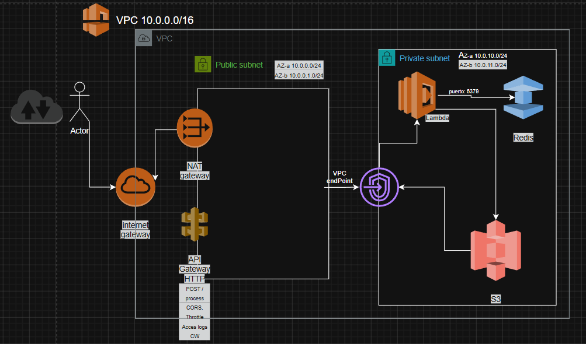

# SRE — Arquitectura Serverless en AWS

Este proyecto usa Terraform para crear, en AWS, un servicio HTTP que procesa datos y guarda los resultados en una caché. Usa 5 piezas de AWS: **VPC, API Gateway, Lambda, ElastiCache (Redis) y S3**.

## Resumen

Cuando alguien llama a `POST /process` con un body JSON, la Lambda hace esto:

1. Calcula una "clave" única a partir del contenido del request (un hash).
2. Busca esa clave en Redis (la caché):
   - **La encuentra (HIT)** → devuelve el resultado guardado, sin procesar nada de nuevo. Responde con el header `X-Cache: HIT`.
   - **No la encuentra (MISS)** → procesa el contenido (calcula un hash SHA-256 y el texto al revés), guarda el resultado en S3 y también en Redis (por 60 segundos), y responde con `X-Cache: MISS`.
3. Si algo falla en el camino, el error queda registrado en CloudWatch y la respuesta es un HTTP 500 explicando qué pasó.

## Arquitectura



Descripción:

- Todo se desarrolla dentro de una **VPC**, con 2 subredes públicas y 2 privadas, repartidas en 2 zonas de disponibilidad (para no depender de un solo building de AWS).
- **API Gateway** recibe las peticiones HTTP desde internet y se las pasa a la Lambda.
- La **Lambda** se aloja en subredes privadas — no tiene IP pública. Para salir usa:
  - Un **NAT Gateway** (en una subred pública), para internet en general.
  - Un **VPC Endpoint**, para hablar con S3 directo, sin pasar por internet.
- **ElastiCache (Redis)** alojada en subredes privadas. Solo Lambda puede conectarse a él por el puerto 6379.
- **S3** guarda los resultados procesados. Solo Lambda puede escribir ahí.

## Flujo paso a paso

1. El cliente hace `POST /process` con un body JSON (elijo PostMan por facilidad).
2. API Gateway recibe la petición y se la pasa a Lambda (integración proxy).
3. Lambda calcula la clave de caché y pregunta a Redis si ya tiene una respuesta guardada (`GET`).
   - **Si Redis responde algo (HIT)**: lambda devuelve ese resultado tal cual, con el header `X-Cache: HIT`.
   - **Si Redis no tiene nada (MISS)**: Lambda,
     1. procesa el contenido (hash SHA-256 + el texto al revés),
     2. guarda ese resultado en S3, en `results/<fecha>/<id>.json`,
     3. lo guarda también en Redis, con una caducidad (`TTL`) de 60 segundos,
     4. y responde con el resultado y el header `X-Cache: MISS`.
4. Si algo falla en cualquier paso (Redis no contesta, error al guardar en S3, etc.), la Lambda registra el error en CloudWatch y responde con un HTTP 500 y un mensaje describiendo el problema.

## Decisiones técnicas del proyecto

### API Gateway: HTTP API

API Gateway ofrece dos tipos de API: **HTTP API** (más nueva y simple) y **REST API** (más vieja, con más opciones). Elegí **HTTP API** debido a que:

- Cuesta hasta ~70% menos que REST API para el mismo tráfico.
- Responde más rápido.
- El CORS se configura con unas pocas líneas, sin crear a mano el método `OPTIONS`.
- El formato del request que recibe la Lambda es más simple
  (`payload_format_version = "2.0"`).

Usaría REST API ante una necesidad de API Keys con límites de uso por cliente, validar el formato del JSON antes de que llegue a la Lambda, o conectarme directo a un balanceador interno.

### Límite de tráfico (throttling) en API Gateway

Para que nadie (por error o a propósito) sature la API con miles de peticiones por segundo, el stage de API Gateway tiene un límite:

- **Rate limit = 10 requests/segundo** en promedio.
- **Burst limit = 20**: picos cortos por encima del promedio que se toleran.

Si se supera, API Gateway responde `429 Too Many Requests` sin llegar a invocar la Lambda. Son valores bajos a propósito: debido a que es un proyecto de prueba no un proyecto con tráfico real,se protege el costo (menos invocaciones de Lambda) como a Redis (un solo nodo, sin réplicas) de quedarse sin recursos.

### Un solo NAT Gateway

Un **NAT Gateway** es lo que le permite a los servicios en una subred privada (sin IP pública, como Lambda) salir a internet.

En producción se deberia tener **un NAT Gateway por zona de disponibilidad**
(2 en este caso), debido a que que si una zona falla, la otra siga funcionando. En este propyecto se usa solo 1 para ahorrar costo: cada NAT Gateway cuesta ~$0.045 por hora, las 24 horas, esté en uso o no.

> El flujo principal de este ejercicio (Redis y S3) **no depende del NAT**. Redis está en la misma red (VPC) y S3 se alcanza por el VPC Endpoint, sin pasar por internet.

### ElastiCache: un solo nodo, sin réplicas

Para Redis se usa un solo nodo `cache.t3.micro`, sin réplicas ni Multi-AZ (copias del nodo en otra zona de disponibilidad). Si ese nodo falla, se pierde la caché — pero como solo es una caché (no datos importantes), no pasa nada grave.

En producción se debe usar un `replication_group` con al menos 2 nodos en zonas distintas y `automatic_failover_enabled = true`, para que si un nodo se cae, otro tome su lugar automáticamente. Sin emnbargo se deben tener en cuenta costos.

### Cliente de Redis: `redis-py`, empaquetado con Docker

Para hablar con Redis desde Python, lo normal es usar la librería `redis-py` (`pip install redis`). El problema: Lambda **no trae instaladas las librerías externas de Python** — solo trae `boto3` (el SDK de AWS).

Para solucionar este inconveniente se usa **Lambda Layer**: una carpeta con librerías que se conecta a la función, como un plugin. Sin embargo Lambda corre en Linux, pero el desarrollo es en Windows, y algunas librerías de Python se compilan distinto según el sistema operativo. Para que la librería sea compatible se debe construir dentro de un contenedor Docker que imita el entorno de Lambda (`scripts/build_layer.sh`, con la imagen oficial `public.ecr.aws/sam/build-python3.12`).

En conclusión:

- `layer/requirements.txt` dice qué instalar (`redis==5.0.8`).
- `scripts/build_layer.sh` lo instala dentro de Docker, en `layer/python/`.
- Terraform empaqueta esa carpeta como una Lambda Layer y la conecta a la función.
- **`terraform apply` corre `scripts/build_layer.sh` automáticamente** (vía un  `null_resource` con `local-exec`), solo si cambió `requirements.txt`. 
**NOTA: El único requisito es tener Docker ejecutandose**.


**Nota de rendimiento** el cliente de Redis se crea **una sola vez, fuera de la función `lambda_handler`**. De esta forma si Lambda reutiliza el mismo entorno para varias peticiones seguidas (una invocación "warm"), no hace falta reconectarse a Redis cada vez.

### El código de la Lambda se empaqueta solo

`lambda_function.py` se convierte en un `.zip` automáticamente con el recurso `archive_file` de Terraform — no hace falta ningún script para esto, solo para la Layer de `redis-py`.

### Permisos mínimos (IAM)

Cuando hablamos de "mínimo privilegio" es darle a cada cosa solo los permisos que necesita, hace parte de las correctas formas de seguridad. El rol de la Lambda tiene:

- Un permiso de AWS para manejar conexiones de red dentro de la VPC y para escribir logs en CloudWatch (`AWSLambdaVPCAccessExecutionRole`) — esto es obligatorio para que una Lambda corra dentro de una VPC.
- Un permiso extra, hecho a mano, que solo deja `s3:PutObject` (escribir) sobre `results/*` del bucket. Nunca leer, borrar, ni tocar otra carpeta.

NO se utiliza `s3:GetObject`en este caso porque en un HIT, la respuesta viene de Redis, no de S3 — la Lambda nunca necesita *leer* el bucket.

### Security Groups

Un **Security Group** es la lista de reglas de "quién puede hablar con quién" en la red.

- El **SG de la Lambda** solo permite salida (egress) por dos puertos: `6379` hacia el SG de Redis, y `443` (HTTPS) hacia `0.0.0.0/0` — necesario para hablar con S3 vía el VPC Endpoint, con CloudWatch Logs, y para salir a internet por el NAT si hiciera falta.
- El **SG de Redis** no acepta nada por defecto. La única regla que tiene *"acepta conexiones en el puerto 6379, pero solo si vienen del SG de la Lambda"*. De otra forma ningún otro recurso de la cuenta puede nunca conectarse a Redis.

### Bucket de S3

- **`force_destroy = true`**: permite borrar el bucket con `terraform destroy` aunque tenga archivos adentro (sin esto, Terraform se niega a borrar un bucket que no está vacío).
- **Versionado activado**: si se sobrescribe un archivo, AWS guarda también la versión anterior.
- **Bloqueo de acceso público (las 4 opciones)**: nadie fuera de la cuenta puede acceder al bucket.
- **Cifrado por defecto (SSE-S3/AES256)**: es gratis y buena práctica tenerlo siempre activado.
- **Política del bucket**: solo el rol de la Lambda puede escribir (`s3:PutObject`) dentro de `results/*`.
 
### Servicios adicionales: IAM y CloudWatch Logs

Además de los 5 servicios núcleo (VPC, API Gateway, Lambda, ElastiCache y S3), en el proyecto se usan dos servicios más de AWS:

- **IAM (roles y políticas)**: Lambda necesita un rol propio para poder ejecutarse y hablar con Redis, S3 y CloudWatch.
- **CloudWatch Logs**: tanto la Lambda como API Gateway escriben sus logs automáticamente (no hay que programar nada extra). Es la forma más simple de ver qué pasa en cada request, incluyendo errores. Se configuró una retención de 7 días para no acumular logs para siempre.

No se agregaron otros servicios (Secrets Manager, SQS, SNS, Parameter Store, etc.) porque este ejercicio no maneja secretos propios ni necesita colas o notificaciones.

## Pre-requisitos

Para desplegar este proyecto desde cero:

- **Terraform** >= 1.5
- **AWS CLI** instalado y configurado con credenciales válidas (`aws configure`). El usuario necesita permisos para crear: VPC, subnets, Internet Gateway, NAT Gateway, VPC Endpoints, Security Groups, ElastiCache, Lambda (funciones y layers), roles/políticas IAM, API Gateway (HTTP API), buckets S3 y Log Groups de CloudWatch. 
Para este ejercicio, lo más simple es usar un usuario con la política administrada `AdministratorAccess`.
- **Docker Desktop** ejecutandose (se usa para construir la Lambda Layer de `redis-py` con el mismo sistema operativo que usa Lambda).
- **Bash** para correr los scripts (`scripts/build_layer.sh`, `scripts/test_cache.sh`). En Windows uso **Git Bash**.
- **Curl, Postman**, para probar el endpoint (incluido en Git Bash y en macOS/Linux).

## Cómo desplegar

```bash
terraform init
terraform fmt -check
terraform validate
terraform plan -out=tfplan
terraform apply tfplan
```

`terraform apply` construye automáticamente la Lambda Layer de `redis-py` con Docker — asegurarnos de tener **Docker Desktop ejecutandose** antes de aplicar.

Crear ElastiCache puede tardar varios minutos.

## Pruebas y evidencia obligatoria (MISS → HIT)

### Probar manualmente con curl en GitBash

```bash
API_URL=$(terraform output -raw api_endpoint)
PAYLOAD='{"message": "hola sre test", "value": 42}'

# Petición 1 -> debe responder con header "X-Cache: MISS"
curl -i -X POST "$API_URL/process" \
  -H "Content-Type: application/json" \
  -d "$PAYLOAD"

# Petición 2 (mismo body) -> debe responder con header "X-Cache: HIT"
curl -i -X POST "$API_URL/process" \
  -H "Content-Type: application/json" \
  -d "$PAYLOAD"
```

### Script automatizado

```bash
bash scripts/test_cache.sh "$API_URL"
```

El script manda **dos peticiones POST /process idénticas** y revisa:

- Petición 1 → `X-Cache: MISS` (procesa, guarda en S3, guarda en Redis)
- Petición 2 → `X-Cache: HIT` (responde directo desde Redis)

### Dónde más verificar

- **CloudWatch Logs** → `/aws/lambda/sre-test-process` (logs de la función, incluye el detalle de cualquier error).
- **CloudWatch Logs** → `/aws/apigateway/sre-test-api` (logs de acceso del API Gateway: status, ruta, tamaño de respuesta, etc.).
- **S3** → bucket `terraform output -raw s3_bucket_name`, carpeta
  `results/<fecha>/<id>.json` (aparece un archivo nuevo solo en el MISS). Verificar con:
  ```bash
  aws s3 ls "s3://$(terraform output -raw s3_bucket_name)/results/" --recursive
  ```
- **Redis**: la clave `cache:process:<hash>` caduca a los 60 segundos. Si repite la prueba después de ese tiempo, vuelve a salir MISS.


## Estructura del repositorio

```
test_sre/
├── README.md              # este archivo
├── docs/
│   └── StructureProjectVF.png # diagrama de arquitectura
├── versions.tf             # providers de Terraform (aws, archive, null)
├── variables.tf            # variables de entrada
├── network.tf              # VPC, subredes, NAT, rutas, VPC endpoint
├── security_groups.tf      # reglas de red (Lambda y Redis)
├── redis.tf                 # ElastiCache
├── s3.tf                     # bucket de resultados
├── iam.tf                     # permisos de la Lambda
├── lambda.tf                  # función Lambda + Lambda Layer
├── api_gateway.tf              # API Gateway
├── outputs.tf                  # datos de salida (URLs, nombres, etc.)
├── lambda/
│   └── lambda_function.py      # código de la función
├── layer/
│   ├── requirements.txt        # redis==5.0.8
│   └── python/                  # generado por build_layer.sh (no se versiona)
├── scripts/
│   ├── build_layer.sh           # construye la Lambda Layer con Docker
│   └── test_cache.sh            # prueba MISS -> HIT
└── evidence/                     # evidencia de una corrida real (MISS, HIT, S3)
```